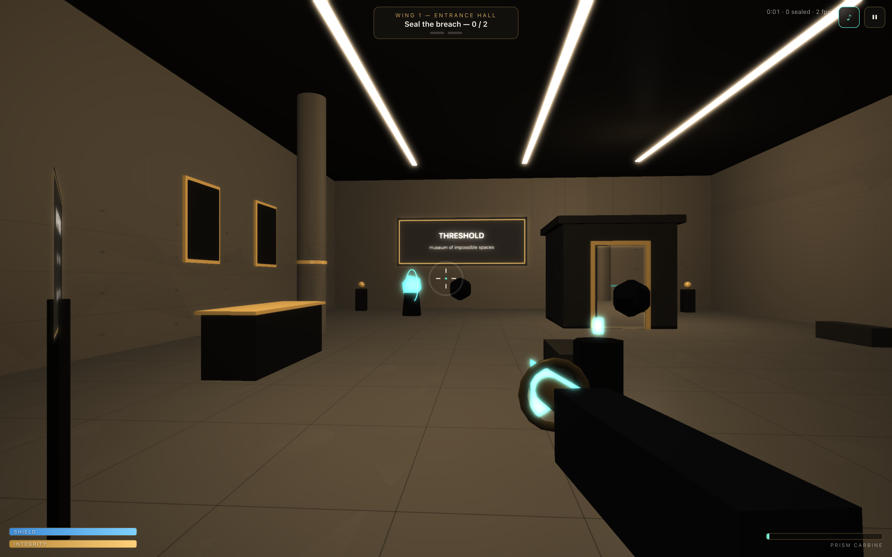

# THRESHOLD: BREACH — a first-person anomaly shooter where the architecture is the enemy

**Live demo:** https://threshold.k1ngp1n.com

You are an anomaly-response operator inside the Threshold Institute. Space is
failing across four wings. Recover the **Prism Carbine**, fight through the
breach, and seal the anchors before the museum — and everything in it — folds in
on you. A short (5–8 minute) browser FPS built on non-Euclidean architecture:
enemies pour out of portals, your shots pass *through* the impossible door to hit
what's on the other side, a corridor loops enemies in behind you, a diorama
becomes a full-size arena, and your reflection fights back.

Everything is **procedural** — no downloaded models, textures, fonts or audio.
No backend. One static bundle behind nginx.


## The hook — the impossible space *is* the mechanic

- **Shoot through the portal.** The Impossible Door renders Room 402 to a texture
  in screen space; a charged shot's ray is re-mapped through the door so you can
  hit enemies standing 250 m away, in another room, through the doorway.
- **The corridor loops.** Wing II spawns hostiles from the "impossible doors" at
  *both* ends — walk forward and something appears behind you.
- **Scale is a weapon.** In Wing III you've been pulled into the diorama; the
  dollhouse reading room is now a full-size arena (same builder, scale 1.0).
- **The reflection fights back.** Wing IV spawns mirrored enemy pairs across the
  glass; there is no mirror — the twin room is built by hand and edited.

## The Prism Carbine

| Input | Effect |
|---|---|
| **Left mouse** | fast energy shot (hitscan, tracer, muzzle flash, hit marker, recoil) |
| **Right mouse (hold → release)** | charged shot — pierces and **collapses breach anchors** |
| — | **heat**, not ammo: overfire and it vents; charged shots cost more heat |

Anchors are shielded against normal fire (it pings) — only a charged Prism shot
collapses them. Seal every anchor in a wing to stabilize it and open the breach
gate to the next.

## Zones & enemies

Four gated wings: **Entrance Hall** (tutorial + through-portal shot) →
**Loop Corridor** → **Scale Gallery** → **Mirror Atrium** (final breach, slow-mo
collapse, result screen). Three enemy archetypes:

- **Echo** — fast melee swarm, rushes you.
- **Shard** — ranged, fires slow visible projectiles you can dodge (crouch/strafe).
- **Warden** — heavy, blinks between portal points, guards anchors.

<table>
  <tr>
    <td></td>
    <td></td>
  </tr>
  <tr>
    <td></td>
    <td></td>
  </tr>
  <tr>
    <td></td>
    <td></td>
  </tr>
</table>

## Controls

| Input | Action |
|---|---|
| <kbd>W A S D</kbd> | move · <kbd>Shift</kbd> sprint · <kbd>Space</kbd> jump · <kbd>Ctrl</kbd> crouch |
| Mouse (pointer lock) | look · <kbd>L-click</kbd> fire · <kbd>R-click hold</kbd> charge → seal anchor |
| <kbd>E</kbd> | interact (pick up the carbine, enter breach gates) |
| <kbd>Esc</kbd> | pause · <kbd>M</kbd> sound |

**Touch:** left joystick to move, drag the right of the screen to look,
**FIRE / PULSE / JUMP / DUCK** buttons. Full FPS on a phone is hard, so touch gets
an aim-forgiving layout; it never breaks the composition.
**`prefers-reduced-motion`** removes screen shake, muzzle strobe, slow-mo and idle
bob. **Quality tiers:** `?quality=low|medium|high` (auto: high desktop, low touch)
scale particles, bloom, hardware resolution and enemy spawn caps.

## Stack

- **Babylon.js 8** + **TypeScript** + **Vite** — chosen for built-in
  collide-and-slide movement, render-target portals, and a WebXR-ready base.
- Custom systems: fixed kinematic FPS controller, screen-space **portal renderer +
  ray-remap** (shoot through walls of space), hitscan/heat weapon, hovering
  enemy AI with projectiles, charged-shot destructible anchors, a **game director**
  driving gated zones / spawn waves / win-lose.
- Combat juice: tracers, muzzle flash, GPU spark bursts, self-correcting screen
  shake + recoil, enemy dissolve, damage vignette, slow-mo on the final anchor.
- Procedural everything (seeded-canvas textures, canvas signage, synthesized
  WebAudio). Tiny observable store; no UI framework in the render loop.
- Playwright QA rig driving a deterministic `window.__BREACH__` debug API.
- nginx + Docker for hosting.

## Run locally

```bash
npm install
npm run dev        # http://localhost:5173

npm run build      # type-check + production bundle in dist/
npm run preview    # serve the build on http://localhost:4173
```

## QA & screenshots

```bash
npm run build
npm run shots      # captures docs/screenshots/*.png from the production build
npm run qa         # Playwright: 16 checks
```

The QA rig verifies: app loads, play starts (title → playing), the player can
move / jump / crouch, shooting kills an enemy, a breach anchor can be destroyed,
≥ 2 zones are reachable, no console errors, no horizontal overflow at
360 / 390 / 768 / 1440, and all screenshots are ≤ 4000 × 4000.

## Docker

```bash
docker build -t threshold .
docker run -d --name threshold -p 3800:80 threshold
```

Behind Caddy on the VPS:

```caddy
threshold.k1ngp1n.com { reverse_proxy 127.0.0.1:3800 }
```

## Compromises (honest notes)

- The Impossible Door is **render + shoot-through only** — walking through it is
  blocked by an invisible pane, so combat stays inside a defined arena. (The
  original walk-through museum version lives in this repo's history.)
- Enemies **hover and integrate** (no per-enemy mesh collisions) for perf with
  many agents; the player uses full ellipsoid collide-and-slide.
- Wing transitions are **fade-teleports through breach gates** rather than long
  traversal, to keep the 5–8 minute slice tight and deterministic for QA.
- Balance is tuned for a short run; enemy caps scale down on `?quality=low` and
  touch.

---

Part of the [k1ngp1n.com](https://k1ngp1n.com) demo collection. Synthetic
content; the Threshold Institute is not a real place — it couldn't be.
