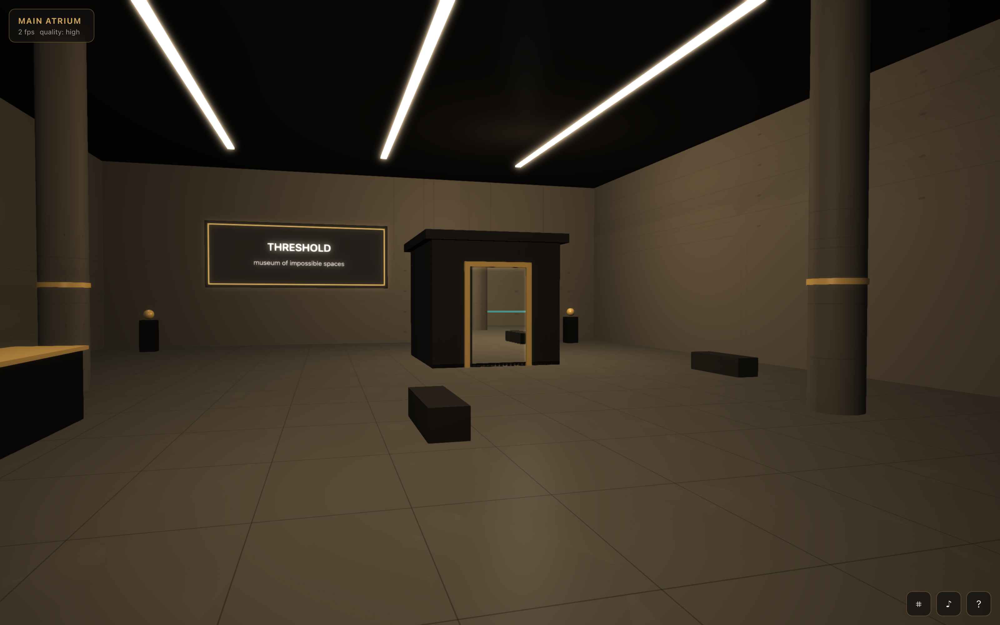
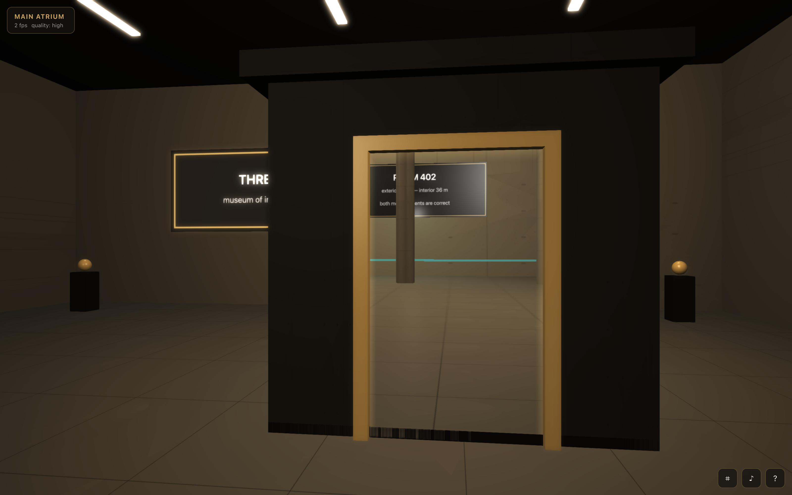
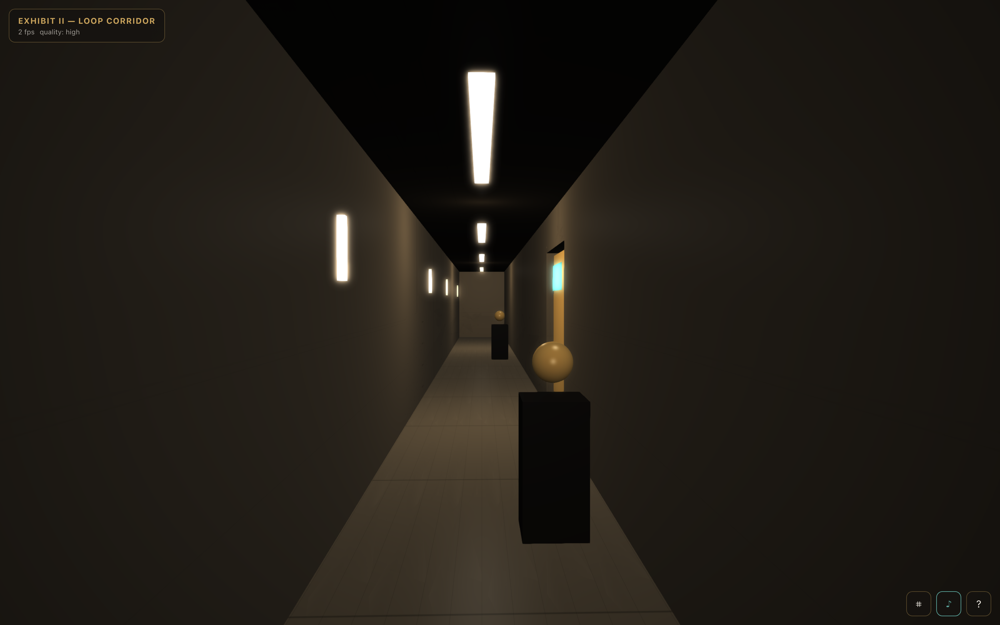
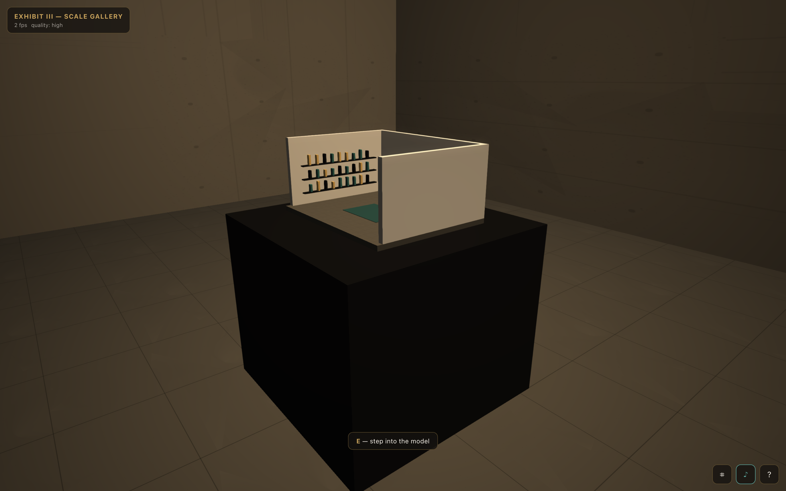
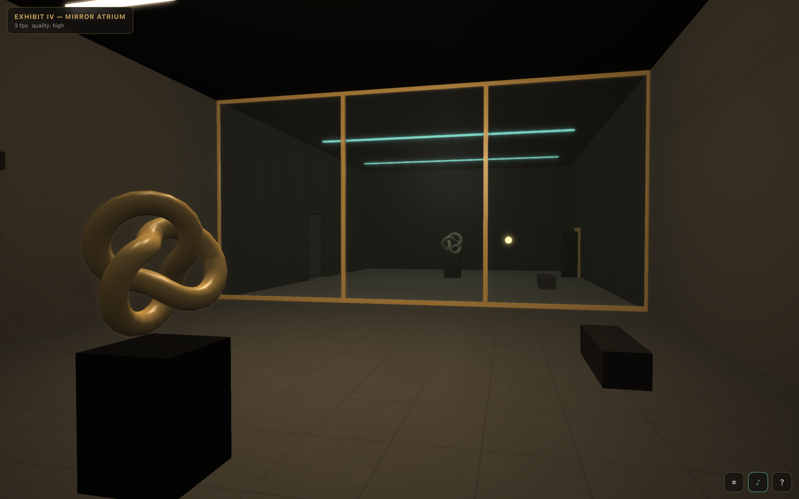

# THRESHOLD — a walkable museum of impossible spaces

**Live demo:** https://threshold.k1ngp1n.com

You walk, first-person, through the *Threshold Institute* — a small museum whose
four exhibits cannot exist. A shed that contains a cathedral-sized hall. A
corridor that returns you to where you started, with the catalogue quietly
rewritten. A dollhouse you step into. A reflection that disagrees with you.

The point is not just the 3D scene — it is the **"how does it work?"** moment.
Press <kbd>X</kbd> at any time and the museum turns itself inside out: wireframe
mode plus a sector map showing the trick behind the room you are standing in.
Every exhibit also has a curator's note that explains its own illusion.

Everything is **procedural** — no downloaded models, textures, fonts or audio.
No backend. One static bundle behind nginx.



## The four exhibits

| Exhibit | What you experience | How it actually works |
|---|---|---|
| **I — Impossible Door** | A 4.2 m garden-shed pavilion; through its door you see (and enter) a 36 m vaulted hall | True portal rendering: a second camera mirrors your pose through the door mapping into a render target, sampled in **screen space** (`gl_FragCoord`), so the quad reads as a hole in space. Crossing the plane teleports you 232 m east, momentum preserved — no cut, no fade |
| **II — Loop Corridor** | Walk forward, arrive where you began; plaques and pedestal artifacts change each lap; after 3 laps a storage door unlocks | Two invisible **translation gates** silently shift you ±14 m between identical segments. Entry/exit pass through dark "light-locks" (museum baffles) that hide two more 286 m jumps |
| **III — Scale Gallery** | A dollhouse reading room on a pedestal; interact, the camera dives in, and the same room is real around you — with the dollhouse on its table, again | The miniature and the room are the **same builder function** at scale 0.09 and 1.0. "Entering" is a camera dolly + fade + 300 m teleport. Recursion included |
| **IV — Mirror Atrium** | A glass wall with your room reflected — but the statue faces away, the far door stands open, the plaque answers back, and an amber presence stands exactly where you stand | There is no mirror and no RTT: the twin room is **built by hand**, reflected across the glass plane, then edited. The orb maps your position through the plane every frame. The light switch behaves differently on each side |

<table>
  <tr>
    <td></td>
    <td></td>
  </tr>
  <tr>
    <td></td>
    <td></td>
  </tr>
</table>

## Stack

- **Babylon.js 8** (chosen over three.js for built-in collide-and-slide FPS camera,
  render-target plumbing and a WebXR-ready architecture), **TypeScript**, **Vite**
- Custom portal system: screen-space RTT portals + deterministic translation gates
- Procedural everything: concrete/floor textures are seeded-canvas `DynamicTexture`s,
  signage is canvas text, ambience/SFX are synthesized WebAudio (noise + filters)
- Tiny hand-rolled observable store (no framework in the render loop)
- QA: Playwright end-to-end rig driving a deterministic `window.__THRESHOLD__` debug API
- nginx + Docker for hosting

## Controls

| Input | Action |
|---|---|
| <kbd>W A S D</kbd> / arrows | walk (<kbd>Shift</kbd> — brisk pace) |
| Mouse (pointer lock) / drag | look |
| <kbd>E</kbd> | interact — enter the model, read plaques, flip the mirror lights |
| <kbd>X</kbd> | x-ray: wireframe + sector map + "how this zone works" |
| <kbd>H</kbd> | help / about |
| <kbd>M</kbd> | sound on/off |

**Touch devices** get a cinematic tour mode: drag to look, ◀ ▶ to move between
eight viewpoints, ◉ to interact. **`prefers-reduced-motion`** removes camera
dollies, shimmer and idle animation (fast crossfades instead).
**Quality tiers:** `?quality=low|medium|high` (auto: high on desktop, low on touch).

## Run locally

```bash
npm install
npm run dev        # http://localhost:5173

npm run build      # type-check + production bundle in dist/
npm run preview    # serve the build on http://localhost:4173
```

## QA

```bash
npm run build
npm run shots      # captures docs/screenshots/*.png from the production build
npm run qa         # Playwright: 19 checks
```

The QA rig verifies: app boots without console errors, canvas is non-blank
(pixel variance), WASD moves the player, every zone is reachable, the
Impossible Door actually relocates you 232 m on crossing, the Loop Corridor
loops (24 m walked → < 14 m net + lap counter), interact works end-to-end
(pedestal → reading room), no horizontal overflow at 360/390/768/1440, and all
screenshots are ≤ 4000×4000.

## Docker

```bash
docker build -t threshold .
docker run -d --name threshold -p 3800:80 threshold
```

Behind Caddy on the VPS:

```caddy
threshold.k1ngp1n.com { reverse_proxy 127.0.0.1:3800 }
```

## Screenshots

All in [`docs/screenshots/`](docs/screenshots): entrance, the four exhibits,
mobile tour mode, reduced-motion. Regenerate with `npm run shots`.

---

Part of the [k1ngp1n.com](https://k1ngp1n.com) demo collection. Synthetic
content; the Threshold Institute is not a real museum — it couldn't be.
