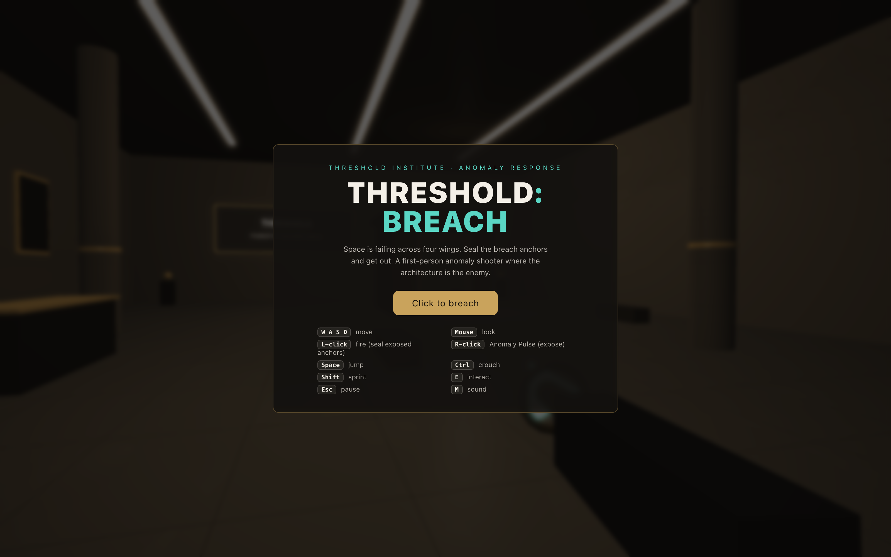
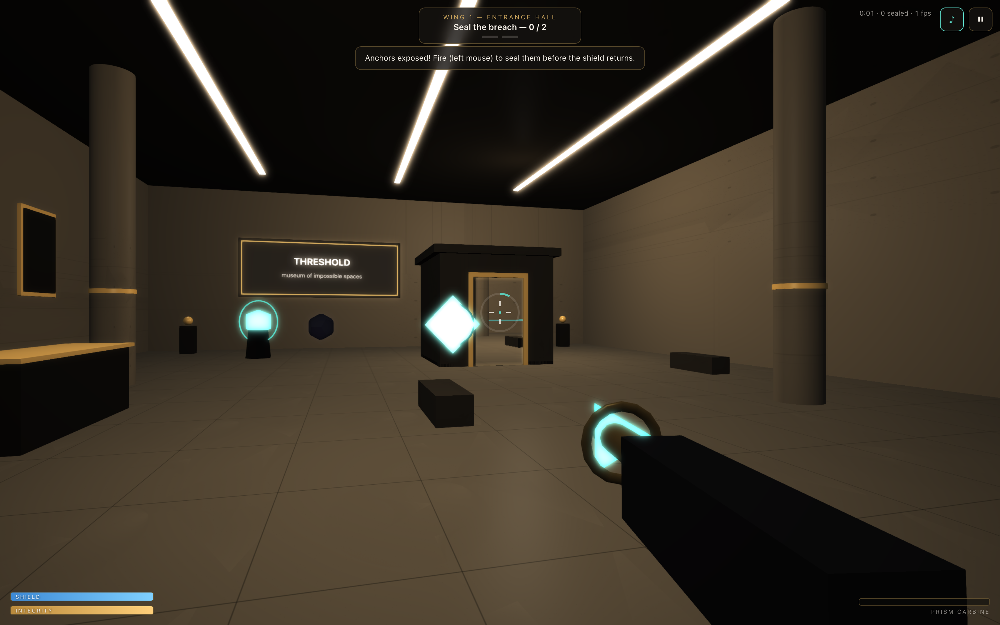
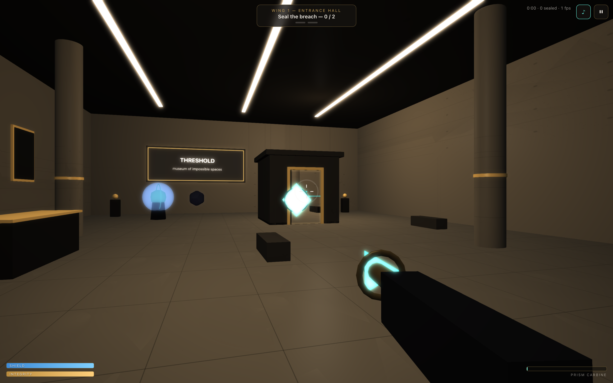
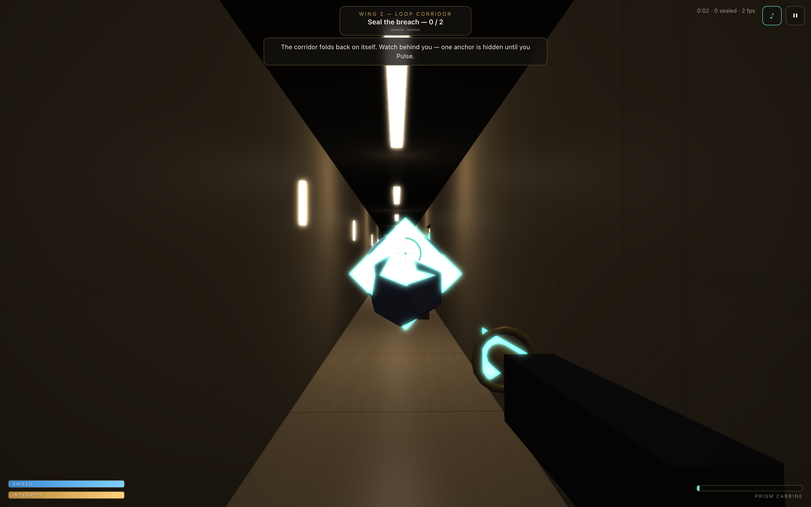
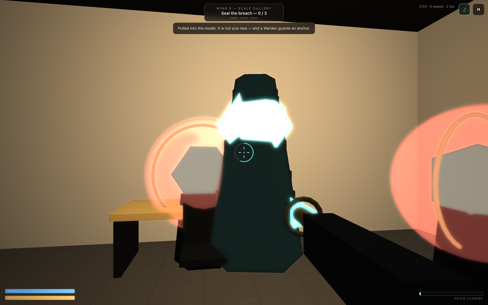
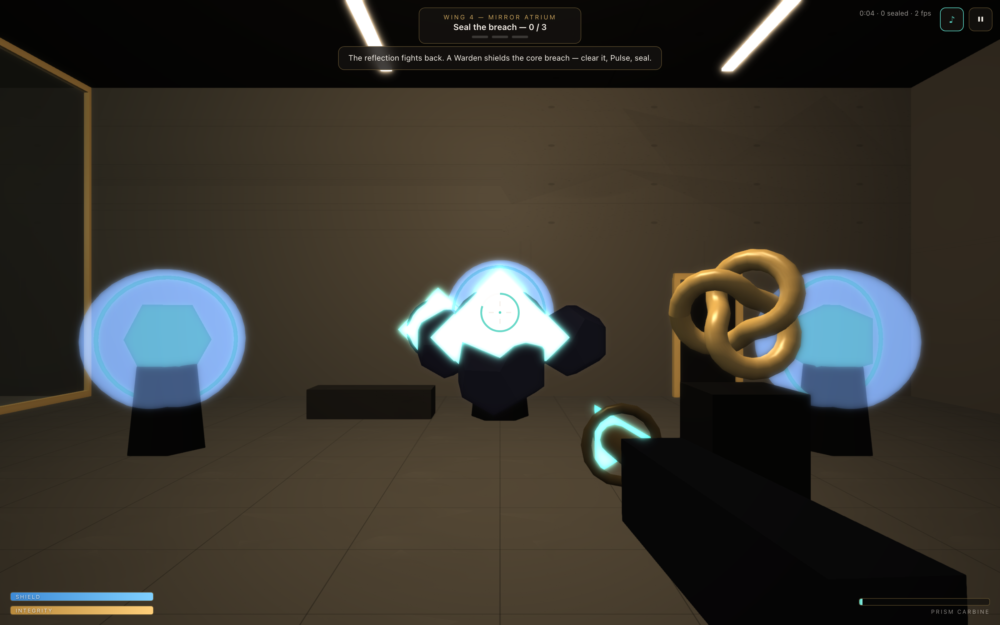
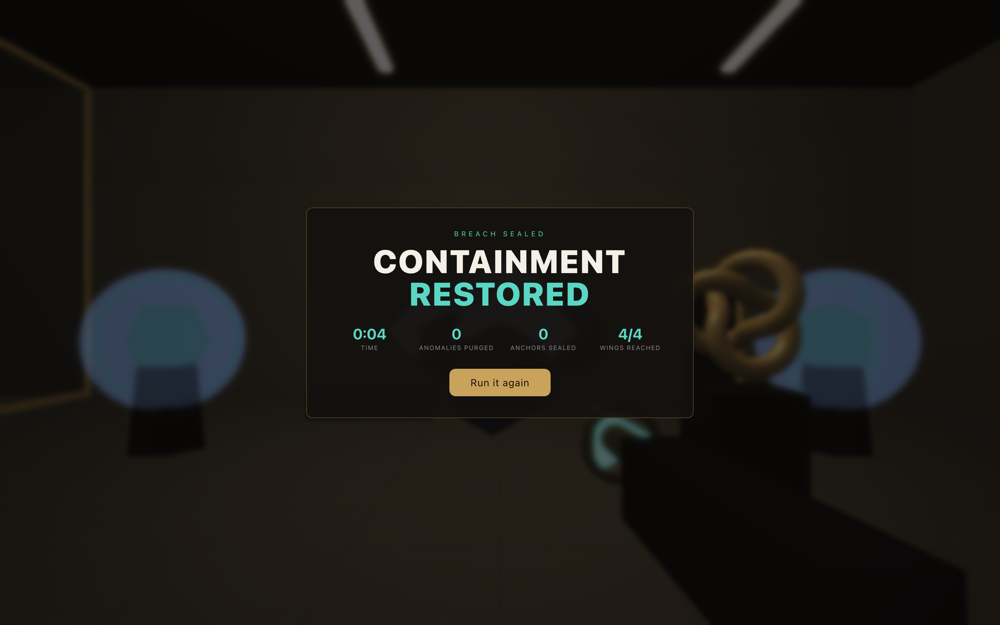
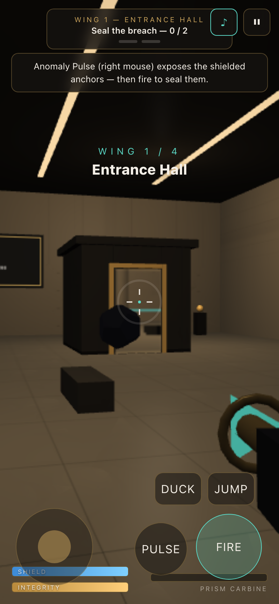

# THRESHOLD: BREACH — browser FPS where space itself is the weapon and the enemy

**Live demo:** https://threshold.k1ngp1n.com

A short, replayable first-person shooter set in a museum of impossible spaces.
You don't just shoot — you weaponize the anomaly. Fire the **Anomaly Pulse** to
tear the shields off breach anchors, slow incoming fire and knock the horde back;
then seal the anchors before space folds back over them. Four wings, ~3–5 minutes,
built to make you hit **restart**.

Everything is **procedural** — no downloaded models, textures, fonts or audio.
No backend. One static bundle behind nginx.



## The 30-second hook

1. **What to do:** seal the glowing breach anchors in each wing.
2. **Why it's unusual:** anchors sit behind shields — normal fire just pings. Your
   **Anomaly Pulse (right mouse)** is the key: it drops every anchor's shield for
   a few seconds, reveals hidden ones, slows enemy projectiles and staggers melee.
   Pulse → the anchors open → **fire to seal them before the shield returns.**
3. **Why restart:** tight run timer, escalating wings, and the space itself keeps
   turning the fight against you.



## Core mechanic — Anomaly Pulse (RMB)

Not a secondary attack — your signature power, on a recharge meter (the ring
around the crosshair):

- **Exposes** every breach anchor in the wing (drops the shield) and **reveals**
  hidden anchors.
- **Slows** enemy projectiles so you can walk them down.
- **Knocks back & staggers** nearby melee enemies — a panic button.
- Strong feedback: expanding shockwave ring, teal screen flash, low thump, sparks.

A **Warden** near an anchor keeps its shield locked (it glows red) — kill the
Warden first, then Pulse.

## Enemies

- **Echo** — fast melee swarm. Rushes you, dies quick, creates panic.
- **Shard** — ranged; fires a slow, visible projectile you can dodge or slow with a Pulse.
- **Warden** — heavy; blinks between portal points and shields the anchor it guards.

## The four wings

| Wing | Gimmick |
|---|---|
| **Entrance Hall** | Tutorial fight — learn shoot → Pulse → seal. Enemies pour from the Impossible Door; you can even shoot *through* it into Room 402. |
| **Loop Corridor** | The corridor folds back on itself; enemies spawn behind you. One anchor is **hidden until you Pulse**. |
| **Scale Gallery** | Pulled into the diorama — the model room is now a full-size arena, and a **Warden guards an anchor**. |
| **Mirror Atrium** | Final fight: mirrored enemy pairs, a Warden shielding the core breach, 3 anchors, slow-mo breach closure → result screen. |

<table>
  <tr>
    <td></td>
    <td></td>
  </tr>
  <tr>
    <td></td>
    <td></td>
  </tr>
  <tr>
    <td></td>
    <td></td>
  </tr>
</table>

## Controls

| Input | Action |
|---|---|
| <kbd>W A S D</kbd> | move · <kbd>Shift</kbd> sprint · <kbd>Space</kbd> jump · <kbd>Ctrl</kbd> crouch |
| Mouse (pointer lock) | look |
| <kbd>L-click</kbd> | fire — seals *exposed* anchors, kills enemies |
| <kbd>R-click</kbd> | **Anomaly Pulse** — expose anchors, slow projectiles, knock back |
| <kbd>E</kbd> | interact (enter breach gates) · <kbd>Esc</kbd> pause · <kbd>M</kbd> sound |

**Touch:** joystick to move, drag the right of the screen to look, **FIRE / PULSE /
JUMP / DUCK** buttons, and the on-screen hint is tappable to interact. Desktop
recommended, but mobile is functional and never breaks the layout.
**`prefers-reduced-motion`** cuts shake, flashes, slow-mo and idle bob.
**Query params:** `?quality=low|medium|high`, `?seed=demo` (deterministic run),
`?qa=1` (test hooks).

## Run loop

Clear all four wings in one short run. Victory **and** defeat show the same stats —
time, anomalies purged, anchors sealed, wings reached — with a one-click restart.
(These stats are the seed for a future leaderboard / telemetry backend.)

## Stack

- **Babylon.js 8** + **TypeScript** + **Vite** — collide-and-slide FPS movement,
  render-target portals, WebXR-ready base.
- Custom systems: kinematic FPS controller (jump/crouch/sprint), **Anomaly Pulse**
  (expose/reveal/slow/knockback), screen-space **portal renderer + ray-remap**
  (shoot through space), hitscan/heat weapon, hovering enemy AI with slow-able
  projectiles + hit-flash + Warden anchor-guarding, shield/expose breach anchors,
  and a seeded **game director** driving gated wings, spawn waves and win/lose.
- Combat juice: tracers, muzzle flash, GPU sparks, self-correcting screen shake +
  recoil, enemy dissolve, damage + low-health vignette, pulse shockwave, slow-mo.
- Procedural everything (seeded-canvas textures, canvas signage, synthesized
  WebAudio incl. the pulse thump). Tiny observable store; no UI framework in the loop.
- Playwright QA rig driving a deterministic `window.__BREACH__` debug API.
- nginx + Docker.

## Run locally

```bash
npm install
npm run dev        # http://localhost:5173
npm run build      # type-check + production bundle in dist/
npm run preview    # serve the build on http://localhost:4173
```

## QA & screenshots

```bash
npm run build
npm run shots      # captures docs/screenshots/*.png (8 shots)
npm run qa         # Playwright: 18 checks
```

QA verifies: app loads, play starts (title → playing), move / jump / crouch,
shooting kills an enemy, **Anomaly Pulse works**, an anchor can be sealed,
≥ 2 wings reachable, the result screen is reachable, no console errors, no
horizontal overflow at 360 / 390 / 768 / 1440, and screenshots ≤ 4000 × 4000.

## Docker

```bash
docker build -t threshold .
docker run -d --name threshold -p 3800:80 threshold
```

Behind Caddy: `threshold.k1ngp1n.com { reverse_proxy 127.0.0.1:3800 }`

## Known tradeoffs

- The Impossible Door is **render + shoot-through only**; walking through it is
  blocked by an invisible pane so combat stays in a defined arena.
- Wing openings are sealed with invisible barriers (shown as faint teal "breach
  seal" membranes) so each wing is a contained arena.
- Enemies **hover and integrate** (no per-enemy mesh collision) for perf; the
  player uses full ellipsoid collide-and-slide.
- Wing transitions are **fade-teleports through breach gates**, keeping the slice
  tight and deterministic for QA.
- Balance is tuned for a short run; enemy caps scale down on `?quality=low`/touch.

---

Part of the [k1ngp1n.com](https://k1ngp1n.com) demo collection. Synthetic content;
the Threshold Institute is not a real place — it couldn't be.
